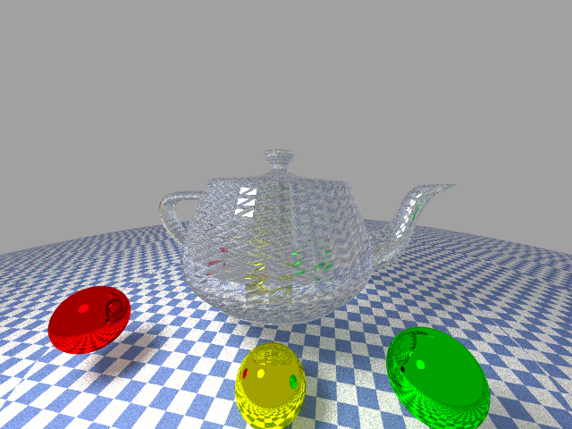
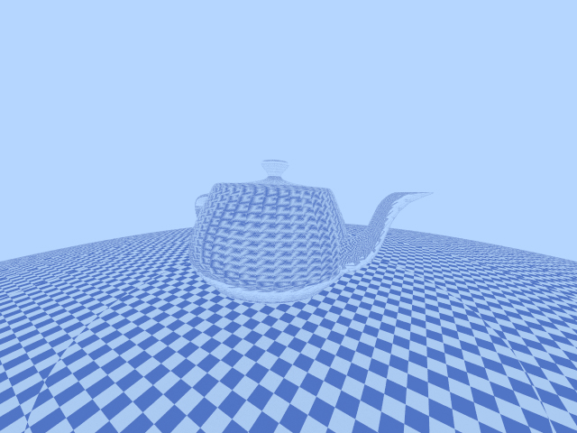
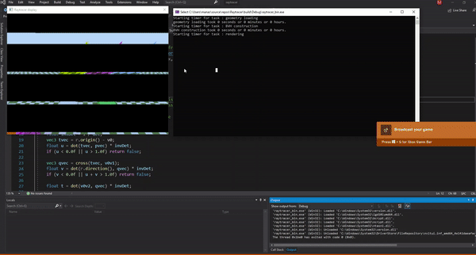
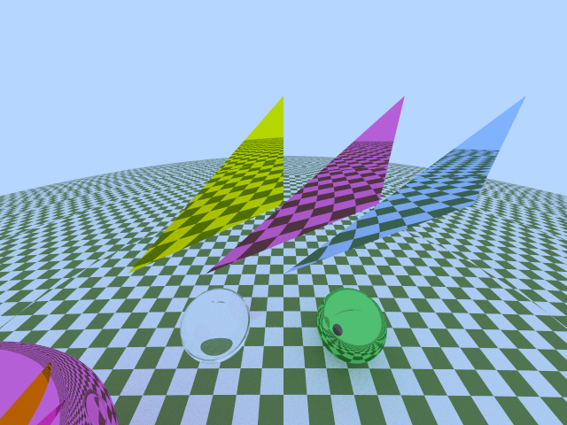
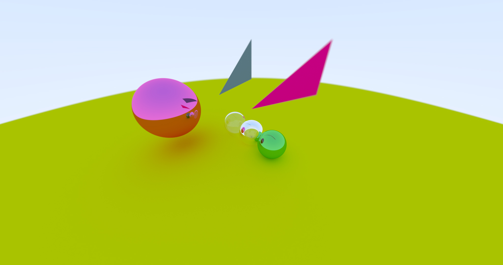

# Raytracer

A (backwards) raytracer I wrote for learning. 

- Using [GLM](https://glm.g-truc.net/) for vector math.
- Using CMake for building and portability.
- Using OpenMP for parallelization.
- Using [OneLoneCoder's](http://www.onelonecoder.com/) incredibly helpful [olcPixelGameEngine](https://github.com/OneLoneCoder/olcPixelGameEngine) for display. 
- Using [TinyObjLoader](https://github.com/tinyobjloader/tinyobjloader) for interpreting .obj and .mtl files.

References used : 
- [Peter Shirley's Raytracing Series](https://www.realtimerendering.com/raytracing/Ray%20Tracing%20in%20a%20Weekend.pdf)
- [PBRT](http://www.pbr-book.org/)
- [Scratchapixel](https://www.scratchapixel.com/)

## TODO : 
- [X] Implement Bounding Volume Hierarchies.
- [X] Parallelize.
- [ ] Study [PBRT's](https://www.pbrt.org/) architecture.
- [ ] Implement a smarter parallelization strategy.
- [ ] Investigate visual artifacts: Insufficient sampling? Inaccurate normals? Improper texture mapping?
- [ ] Use [Intel's Open Image Denoiser](https://github.com/OpenImageDenoise/oidn).

## Features:
- Real time display for image that's being traced
- BVH
- (Naive) parallelization
- Triangle primitives
- OBJ geometry loading
- (Naive) MTL file loading

## Example output:

### Utah teapot:

There are a few visual artifacts in these images, especially with the teapot normals. However, they do demonstrate geometry mesh loading.

### Real time display

This demonstrates that the current parallelization strategy is not ideal. The top thread finishes its work quickly(since there are no objects to intersect near the sky) and then does nothing, wasting compute. A better solution would be to have a worker-assigner model, where a taskmaster assigns free worker thread an area of the scene to render. As soon as a worker is finished, it indicates this to the taskmaster who can then assign more work.

### Sphere and triangle primitives (metallic and dielectric):

### Sphere and triangle primitives (diffuse and dielectric):

The red triangle is blurry because of a narrow depth of field.

## Building instructions 
CMake 3.9 is required.
### Windows:

Visual Studio 2019 is preferred. Older versions should work as well.

Make a directory `build` for the VS solution :

`mkdir build`

Generate VS solution:

`cd build`

`cmake .. -G "Visual Studio 16 2019"`
